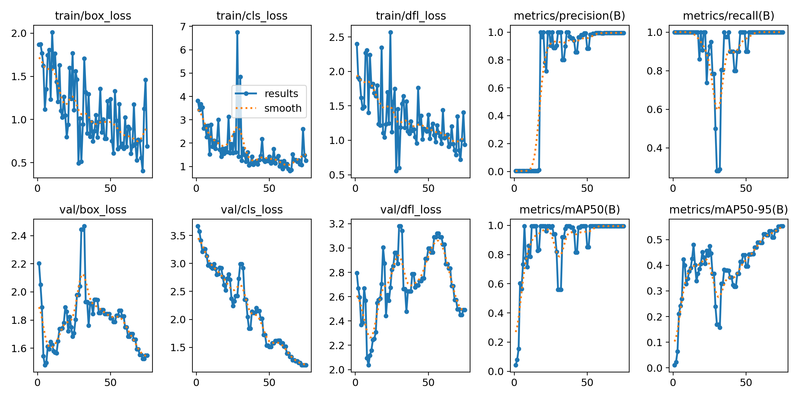

# 🧠 YOLOv8 Face Detection - Custom Trained Model

This project uses [Ultralytics YOLOv8](https://github.com/ultralytics/ultralytics) to detect **my face** from live webcam input. The model was custom-trained on personal image data and deployed using OpenCV on macOS.

---

## 📸 Demo

[](https://www.youtube.com/watch?v=_yJEXPrk828)

See it in action: real-time face detection using YOLOv8 and OpenCV. > Detects my face in real time using my Mac's webcam.

---

## 🚀 Features

- ✅ Real-time face detection using webcam
- ✅ YOLOv8 custom training with annotated dataset
- ✅ Live inference using OpenCV
- ✅ Clean training metrics and high accuracy
- ✅ Runs on macOS with Apple M1

---

## 🧰 Technologies Used

- [Python 3.13](https://www.python.org/)
- [Ultralytics YOLOv8](https://github.com/ultralytics/ultralytics)
- [OpenCV](https://opencv.org/)
- [PyTorch](https://pytorch.org/)

---

## 🏁 Getting Started

1. **Install dependencies**

```bash
pip install ultralytics opencv-python


```
## Train the model 

1. Use main.py to train, read comments in the code to help you understand. 

## ⚙️ Config (config.yaml)
path: absolute path to your data<br>
train: images/train<br>
val: images/val

names:
  0: you

## 📈 Training Results

Here are the training curves and performance metrics after 75 epochs:



## 📈 TLDR Training Results

| Metric         | Value       |
|----------------|-------------|
| mAP@0.5        | 1.00        |
| mAP@0.5:0.95   | 0.55        |
| Precision      | ~1.00       |
| Recall         | ~1.00       |
| Epochs Trained | 75          |


## Disclaimer: This will not work without your data, this project was built specifically for my face, so the code will work if tweaked by changing paths to your data. This is to help you get started on it. 
